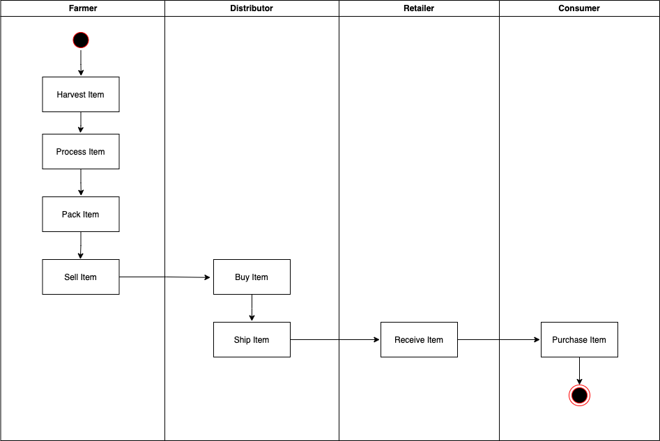
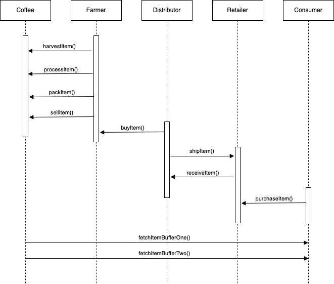
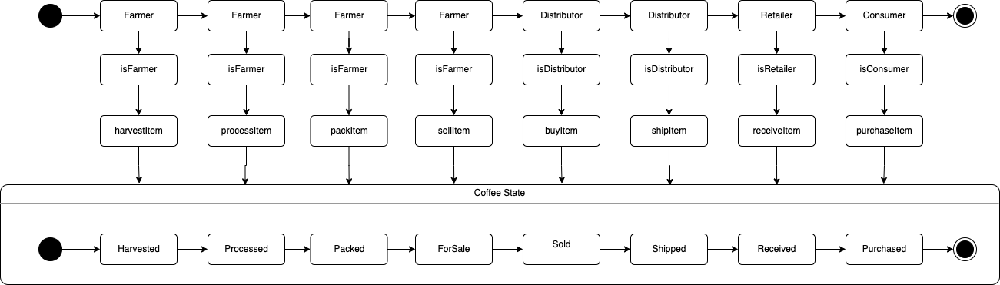
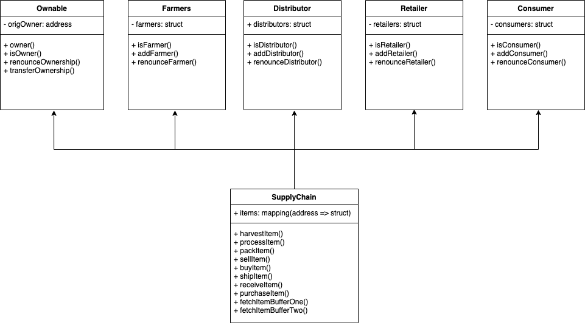

# Ethereum Dapp for Tracking Items through Supply Chain
---

This repository containts an Ethereum DApp that demonstrates a Supply Chain flow between a Seller and Buyer. The user story is similar to any commonly used supply chain process. A Seller can add items to the inventory system stored in the blockchain. A Buyer can purchase such items from the inventory system. Additionally a Seller can mark an item as Shipped, and similarly a Buyer can mark an item as Received.

---

## Submission Info

Since rinkeby network is already deprecated, I deployed this project to goerli network.

This project was finished using:
* Goerli Contract Address [0xbac596e2056a00be82df21fa81821b7ee0ee1588](https://goerli.etherscan.io/address/0xbac596e2056a00be82df21fa81821b7ee0ee1588)
* Deployment Transaction ID [0x517684c72f7272a260fd8e3d6f2dc5799cb70c52a43d24b8a30ecdc2e403e8da](https://goerli.etherscan.io/tx/0x517684c72f7272a260fd8e3d6f2dc5799cb70c52a43d24b8a30ecdc2e403e8da)
* Truffle v5.4.33 (core: 5.4.33)
* Ganache v7.0.1
* Solidity 0.6.0 (solc-js) <-- bumped from 0.4.24 in the provided boilerplate
* Node v16.17.1
* Web3.js v1.5.3

## Write Up - UML

##### Activity Diagram



##### Sequence Diagram



##### State Diagram



##### Class Diagram


---

## Write Up - Libraries
There are some nodejs libraries used in this project:
| Library                   | Version | Purpose |
| ------------------------- | ------- | ------- |
| truffle                   | 5.4.33  | development suite for smart contract |
| truffle-hdwallet-provider | 1.0.17  | wallet used to deploy smart contract |
| dotenv          | 16.0.3   | store mnemonic used for contract deployment |


---

## Write Up - IPFS
I don't use IPFS for this project

---

## Installation

Install truffle and ganache globally
```bash
npm install -g truffle@v5.4.33
npm install -g ganache@v7.0.1
```

Install my-project with npm
```bash
  cd project-6
  npm install
```

---

## Running Tests

To run tests, run the following command

```bash
  % truffle develop
  Connected to existing Truffle Develop session at http://127.0.0.1:9545/

  truffle(develop)> test
  Using network 'develop'.


  Compiling your contracts...
  ===========================
  > Everything is up to date, there is nothing to compile.

  ganache-cli accounts used here...
  Contract Owner: accounts[0]  0xd5e61ec6755889Dc7e3d183ea974cC7c9d32bb14
  Farmer: accounts[1]  0xb1618A6b736a335Ab8596a1CE107403F9Dd2AaCb
  Distributor: accounts[2]  0x1114f157e3086Ab3C2367Ff667be38A752a16Db9
  Retailer: accounts[3]  0xaD434d9d22F5C8Fd6B27Cf462763b31Ef709fE45
  Consumer: accounts[4]  0x967C871D84e54d902226791e586899aB0C6F244F


    Contract: SupplyChain
      ✓ Testing smart contract function harvestItem() that allows a farmer to harvest coffee (115ms)
      ✓ Testing smart contract function processItem() that allows a farmer to process coffee (45ms)
      ✓ Testing smart contract function packItem() that allows a farmer to pack coffee (49ms)
      ✓ Testing smart contract function sellItem() that allows a farmer to sell coffee (50ms)
      ✓ Testing smart contract function buyItem() that allows a distributor to buy coffee (64ms)
      ✓ Testing smart contract function shipItem() that allows a distributor to ship coffee (60ms)
      ✓ Testing smart contract function receiveItem() that allows a retailer to mark coffee received (56ms)
      ✓ Testing smart contract function purchaseItem() that allows a consumer to purchase coffee (48ms)
      ✓ Testing smart contract function fetchItemBufferOne() that allows anyone to fetch item details from blockchain (101ms)
      ✓ Testing smart contract function fetchItemBufferTwo() that allows anyone to fetch item details from blockchain (89ms)


    10 passing (903ms)

  - Fetching solc version list from solc-bin. Attempt #1
  - Fetching solc version list from solc-bin. Attempt #1

  truffle(develop)>
```

---

## Deployment

Go to project-6 folder

Create secret for deployment:
1. create a new file named `.secret`
2. paste your mnemonic into the newly created file


Deploy to goerli network
```bash
  truffle migrate --reset --network goerli
```

